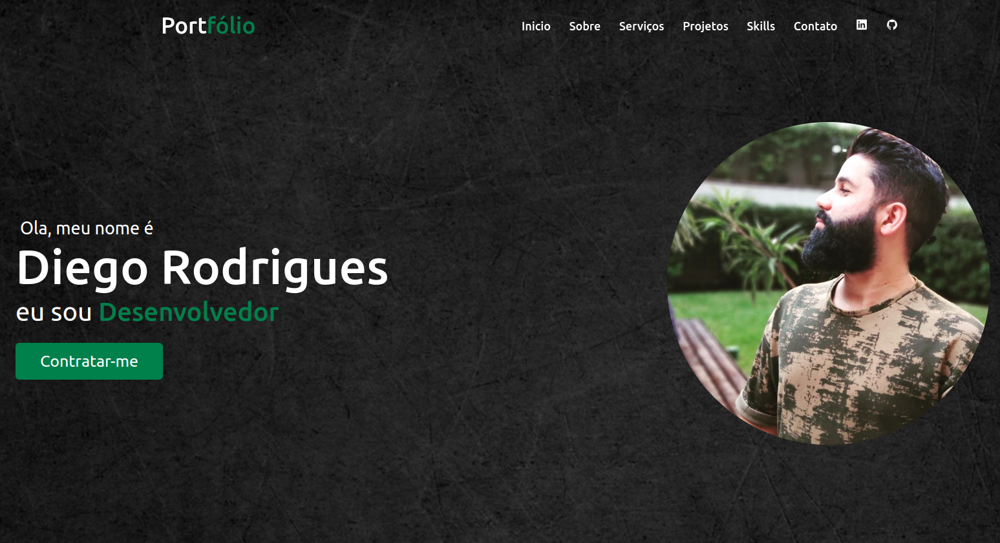

# Portfólio

## Visão Geral

### Acesse em
<a href="https://portfolio-02-pi.vercel.app" target="_blank">https://portfolio-02-pi.vercel.app</a>

  
Meu portfólio é um site pessoal que exibe meus projetos, habilidades e informações relevantes sobre mim. O objetivo principal deste projeto é apresentar meu trabalho e experiência de uma maneira organizada e atraente.
Recursos e Tecnologias Utilizadas

- HTML: Utilizado para estruturar e criar a base do site.
- CSS: Responsável pela estilização e aparência visual do site.
- JavaScript: Adiciona interatividade e funcionalidades dinâmicas ao site.
- jQuery: Biblioteca JavaScript que facilita a manipulação do DOM e a criação de animações e efeitos.
- PHP: Utilizado para o desenvolvimento de funcionalidades back-end, como o envio de formulários e o processamento de dados.

## Funcionalidades

- Exibição dos projetos: Apresentação dos meus projetos com detalhes, imagens e links relevantes.
- Formulário de contato: Permite que os visitantes entrem em contato comigo por meio de um formulário.
- Envio de email: Utiliza PHP para enviar os dados do formulário para meu endereço de email.
- Responsividade: O site é adaptável a diferentes dispositivos e tamanhos de tela.

## Como Executar o Projeto

*Faça o clone deste repositório em sua máquina local.
Abra o arquivo `index.html` em seu navegador para visualizar o portfólio.*

## Contribuições

Contribuições são bem-vindas! Se você encontrar algum problema, tiver sugestões ou quiser melhorar este projeto, sinta-se à vontade para abrir uma issue ou enviar um pull request.
Licença

Este projeto está licenciado sob a Licença MIT.